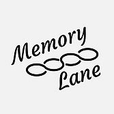

# Memory Lane
> The iOS app works with the Memory Lane box.

[![Swift Version][swift-image]][swift-url]
[![xcode-version][xcode-image]][xcode-url]
[![build-status][build-image]][build-url]
[![License][license-image]][license-url]

Memory Lane project is a Global Innovation Exchange Launch Project. This iOS app is designed and developed for an iPad which can be placed on a tangible device to provide simple physical interaction to help older adults with dementia to navigate and annotate the music or video content for reminiscence therapy.



## Features

- Easy and Fail-proof Setup Process
- Button Interaction
- 3D Object Interaction
- Custom context tailored to the users

## Requirements

- iOS 14.0+
- Xcode 12.0+
- Swift 5.0+

### How to run

1. Clone the repo
2. Run ```pod install``` in terminal to install required pods. Make sure you have [CocoaPods](https://guides.cocoapods.org/using/getting-started.html) installed.
2. Make sure to update your app group config (```Signing & Capabilities```, ```App Groups```).


## Meta

Global Innovation Exchange Memory Lane Team
- [Amal M. Abualrahi](https://github.com/AmalTurtle) - amal91@uw.edu
- [Joey Wang](https://github.com/JoeyWangTW) - sywangtw@uw.edu
- [Justice Zheng](https://github.com/qpskcn1) - yiz5@uw.edu

Distributed under the MIT license. See ``LICENSE`` for more information.

[https://github.com/Global-Innovation-Exchange/MemoryLane](https://github.com/Global-Innovation-Exchange/MemoryLane)

[swift-image]:https://img.shields.io/badge/swift-5.x-ea7a50.svg?logo=swift
[swift-url]: https://swift.org/
[license-image]: https://img.shields.io/badge/License-MIT-blue.svg
[license-url]: LICENSE
[build-image]: https://github.com/Global-Innovation-Exchange/MemoryLane/workflows/Build%20Test/badge.svg
[build-url]: https://github.com/Global-Innovation-Exchange/MemoryLane/actions
[xcode-image]: https://img.shields.io/badge/xcode-12.0.1-brightgreen
[xcode-url]: https://developer.apple.com/xcode/